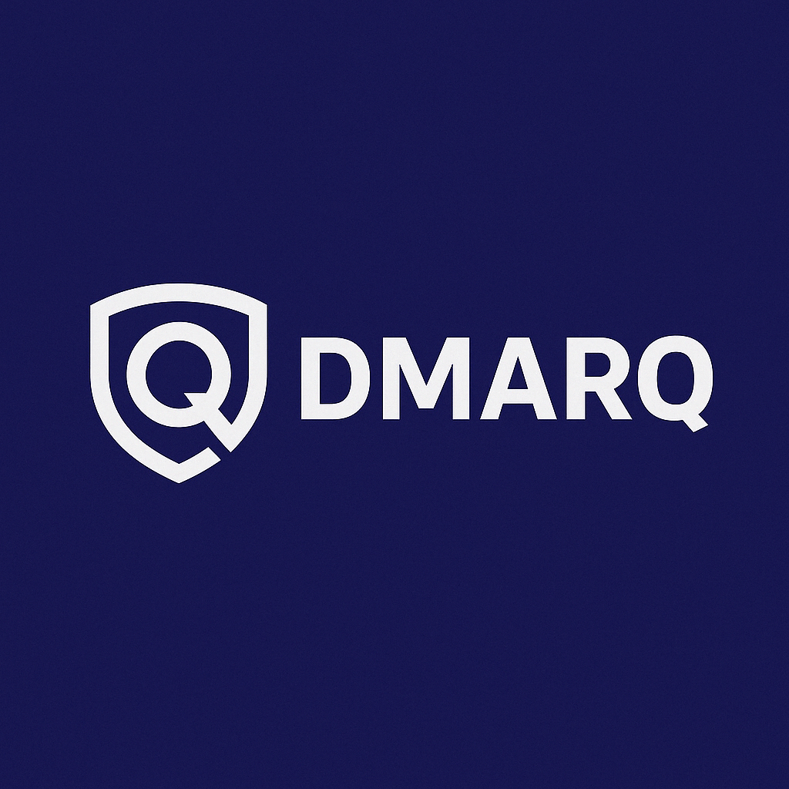

# DMARQ User Guide

*Secure Email. Simplified.*

## Table of Contents

1. [Introduction](#introduction)
2. [Getting Started](#getting-started)
3. [Dashboard Overview](#dashboard-overview)
4. [Managing Domains](#managing-domains)
5. [Viewing Reports](#viewing-reports)
6. [IMAP Configuration](#imap-configuration)
7. [Settings](#settings)
8. [Troubleshooting](#troubleshooting)
9. [FAQ](#faq)

## Introduction

DMARQ is a modern, user-friendly tool designed to make DMARC (Domain-based Message Authentication, Reporting, and Conformance) implementation accessible for everyone. This guide will help you navigate the features and functionalities of DMARQ to effectively manage your email security.

### What is DMARC?

DMARC (Domain-based Message Authentication, Reporting, and Conformance) is an email authentication protocol that builds upon SPF and DKIM. It helps prevent email spoofing, phishing, and other email-based attacks by allowing domain owners to specify how email messages that fail authentication should be handled.

### Benefits of Using DMARQ

- **Simplified Monitoring**: Easily track DMARC compliance across your domains
- **Actionable Insights**: Get clear visualization of authentication failures and patterns
- **Automated Processing**: Automatically retrieve and parse DMARC reports
- **Policy Management**: Manage and adjust your DMARC policies as your compliance improves

## Getting Started

### System Requirements

- Modern web browser (Chrome, Firefox, Safari, Edge)
- Internet connection
- DMARC reports for your domain(s)

### First-Time Setup

1. **Access the DMARQ dashboard**: Navigate to the URL provided by your administrator
2. **Create an account**: Click "Sign Up" and follow the registration process
3. **Add your first domain**: Click "Add Domain" on the dashboard and enter your domain details
4. **Upload a DMARC report**: Use the "Upload Report" button to add your first report

## Dashboard Overview

The DMARQ dashboard provides an at-a-glance view of your email authentication status:

### Key Elements

- **Domain Summary**: Shows all monitored domains with compliance rates
- **Email Volume**: Displays the total number of emails processed
- **Compliance Rate**: Shows the overall DMARC pass rate
- **Recent Reports**: Lists the most recent DMARC reports received

## Managing Domains

### Adding a Domain

1. Click "Domains" in the main navigation
2. Click the "Add Domain" button
3. Enter the domain name and description
4. Click "Save"

### Domain Details

Click on any domain name to view detailed information including:

- Compliance rate over time
- Email volume trends
- Source IP breakdown
- DMARC, SPF, and DKIM records

### DNS Records

DMARQ provides guidance on setting up proper DNS records for email authentication:

1. Navigate to the domain details page
2. Click "Check DNS" to see current records
3. Follow the recommendations to improve your configuration

## Viewing Reports

### Report List

The Reports page shows all DMARC reports received for your domains:

1. Click "Reports" in the main navigation
2. Use filters to narrow down by date, domain, or compliance status
3. Click on a report to view details

### Report Details

The report detail view includes:

- Sending organization information
- Authentication results (SPF, DKIM, DMARC)
- Source IP breakdown
- Recommended actions for failed authentications

## IMAP Configuration

DMARQ can automatically fetch DMARC reports from your email account:

### Setting Up IMAP

1. Go to "Settings" > "IMAP Configuration"
2. Enter your IMAP server details:
   - Server address
   - Port
   - Username
   - Password
   - SSL/TLS settings
3. Set polling interval (how often to check for new reports)
4. Click "Test Connection" to verify
5. Save your settings

### Managing Report Fetching

- Click "Fetch Now" to retrieve reports immediately
- View the status of the background process
- Check logs for any issues with fetching reports

## Settings

### User Settings

Manage your account information and preferences:

- Update your profile information
- Change password
- Set notification preferences

### Domain Settings

Adjust settings for your domains:

- Set default DMARC policy
- Configure alerts for compliance issues
- Set up automatic report archiving

## Troubleshooting

### Common Issues

- **No reports showing**: Check your IMAP settings or try uploading reports manually
- **Authentication failures**: Review DNS records for proper SPF and DKIM configuration
- **Slow dashboard**: Try filtering for a shorter date range

### Support Resources

- Documentation: [DMARQ Docs](https://example.com/docs)
- Community Forum: [DMARQ Community](https://example.com/community)
- Support Email: support@example.com

## FAQ

### What is a good compliance rate?

A compliance rate of 98% or higher is considered excellent. Rates between 90-98% indicate room for improvement, while rates below 90% suggest significant issues that need attention.

### How often should I check my DMARC reports?

For active monitoring, weekly checks are recommended. When implementing changes to SPF or DKIM, more frequent monitoring can help ensure those changes are working properly.

### Can I use DMARQ for multiple domains?

Yes! DMARQ is designed to handle multiple domains. You can add each domain to monitor and see aggregate statistics across all your domains.